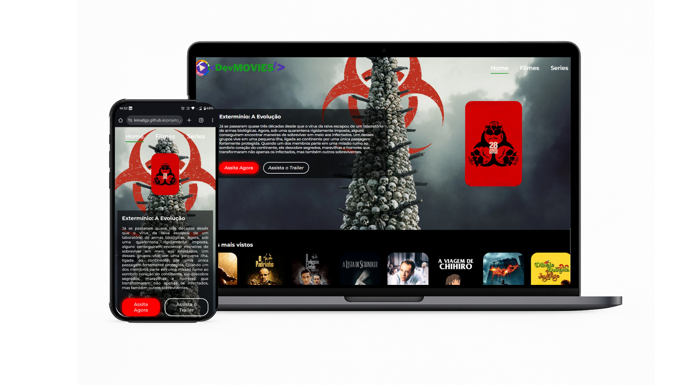

# 🎬 Dev Movies

Projeto web desenvolvido em React que permite explorar filmes populares, ver detalhes, trailers e classificações. A aplicação utiliza uma API externa para buscar os dados dos filmes e apresenta tudo com um design moderno e responsivo.

## 🖼️ Demonstração

## ✨ Funcionalidades

- 🎥 Listagem de filmes populares
- 🔍 Busca por filmes
- 📄 Visualização de detalhes do filme (descrição, avaliação, data de lançamento, etc.)
- 📱 Layout responsivo para desktop e mobile
- 🎨 Carrossel de filmes com **Swiper.js**

## 🛠️ Tecnologias Utilizadas

- React
- JavaScript (ES6+)
- Styled Components
- React Router DOM
- Swiper.js (slider de filmes)
- API The Movie Database (TMDb)
- Git & GitHub
- Deploy via GitHub Pages

## 🌐 Projeto online

👉 [Acesse o Dev Movies aqui](https://leinadgp.github.io/projeto_dev_movie)

